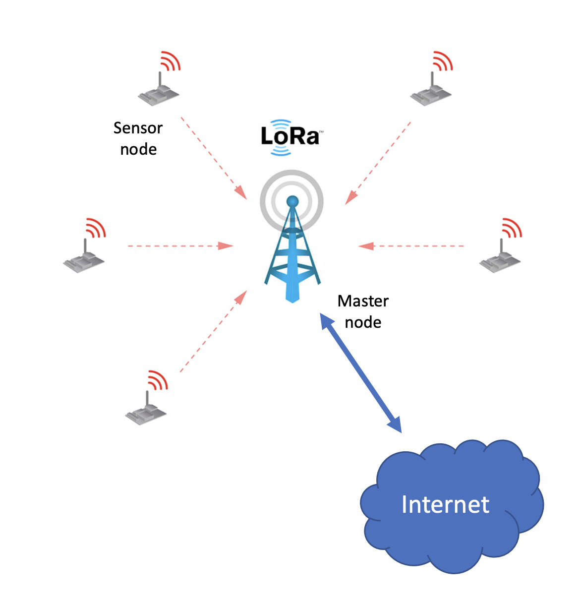
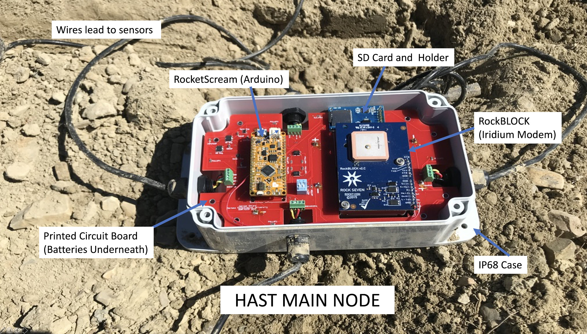
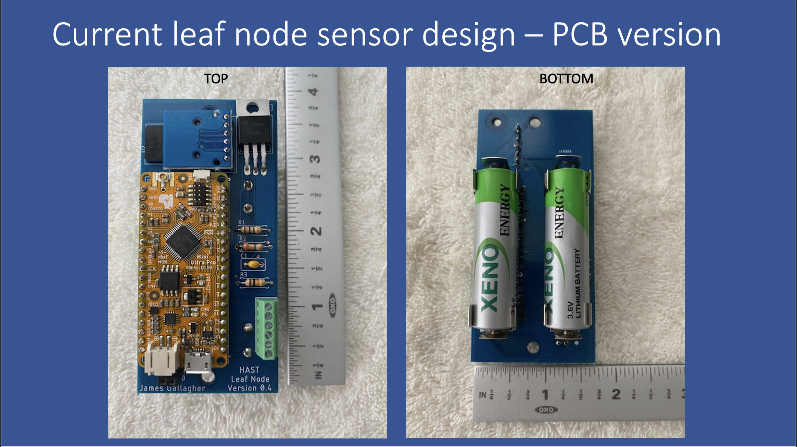
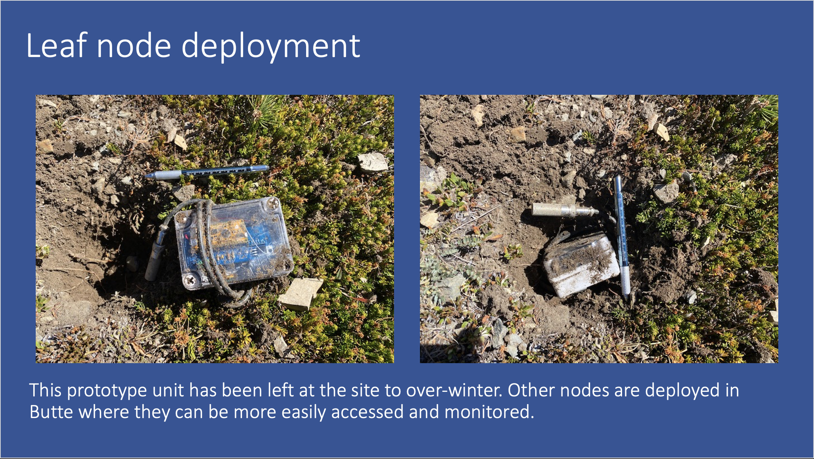

# HAST
Information about the High Altitude Sensor Technology (HAST) Project

## The HAST project
The HAST project is a collaboration between the Montana Technology University Departments of Biology and Electrical Engineering and OPeNDAP. 
The project aims to develop sensor technology that can be used to monitor conditions in the alpine environment in near real-time.

## System Architecture

General description of HAST. Lorem ipsum dolor sit amet, consectetur adipiscing elit, sed do eiusmod tempor incididunt ut labore et dolore magna aliqua. Ut enim ad minim veniam, quis nostrud exercitation ullamco laboris nisi ut aliquip ex ea commodo consequat. Duis aute irure dolor in reprehenderit in voluptate velit esse cillum dolore eu fugiat nulla pariatur. Excepteur sint occaecat cupidatat non proident, sunt in culpa qui officia deserunt mollit anim id est laborum. Lorem ipsum dolor sit amet, consectetur adipiscing elit, sed do eiusmod tempor incididunt ut labore et dolore magna aliqua. Ut enim ad minim veniam, quis nostrud exercitation ullamco laboris nisi ut aliquip ex ea commodo consequat. Duis aute irure dolor in reprehenderit in voluptate velit esse cillum dolore eu fugiat nulla pariatur. Excepteur sint occaecat cupidatat non proident, sunt in culpa qui officia deserunt mollit anim id est laborum. Lorem ipsum dolor sit amet, consectetur adipiscing elit, sed do eiusmod tempor incididunt ut labore et dolore magna aliqua. Ut enim ad minim veniam, quis nostrud exercitation ullamco laboris nisi ut aliquip ex ea commodo consequat. Duis aute irure dolor in reprehenderit in voluptate velit esse cillum dolore eu fugiat nulla pariatur. Excepteur sint occaecat cupidatat non proident, sunt in culpa qui officia deserunt mollit anim id est laborum.

## Presentations
We have made the following presentations of the work during the ESIP Labs funding period of xxx to yyy.
* [ESIP Winter meeting, Januaray 2021](presentations/ESIP_EnviroSensing_Winter_2020_Sensors_2.0.pdf)
* [ESIP Summer meeting, July, 2021](presentations/ESIPSUMMERSNOWMEAJHRG71020_wfonts.pptx)
* [MTech UAS Workshop, November, 2021](presentations/UAS_Seminar_Apple_et_al_11621.pptx)

## Development at MTech
The development of the **main node** at MTech is documented in this Github repository.

* [High Altitude Soil Sensing](https://github.com/mtech-ee/HighAltitudeSoilSensing)

## Development at OPeNDAP
Here are five Github repositories for the HAST leaf node part of the project, all of them are publicly accessible. I don't use the Arduino IDE but instead use a tool PlatformIO that works with MS VisualStudio. It supports multi-file code, etc., and works pretty well with Segger J-Link debugger probes (Segger makes a $20-30 probe for educational use that I have).

* [soild sensor common](https://github.com/jgallagher59701/soil_sensor_common): This Arduino library enables communication between the HAST leaf node and a stand-in main node. The MTech main node could use this library at some point, making the integration work less painful. Note that this _will_ work easily with the Arduino IDE.
* [leaf node](https://github.com/jgallagher59701/HAST_leaf_node): This is the code for the leaf node.
* [leaf node PCB](https://github.com/jgallagher59701/HAST_leaf_node_pcb): The KiCAD files for the leaf node Printed Circuit Board.
* [leaf node data](https://github.com/jgallagher59701/HAST_leaf_node_data): A grab bag of data from various leaf node deployments. Also, in here there is a Jupyter notebook with calculations for the batter life of the leaf node based on current measurements of one copy of the node. The link for that notebook is here: [Compute_Leaf_Node_Current](https://github.com/jgallagher59701/HAST_leaf_node_data/blob/main/Compute_Leaf_Node_Current_2.ipynb). Github renders these notebooks so you don’t have to go through the tedium of running them yourself to see the results.
* [lora main node stand-in](https://github.com/jgallagher59701/HAST_lora_main): This is the code for my main node stand-in. It dumps data to an SD card and to the serial port. Included is a python program to read from said serial port and write the info to a CSV file.

## Current use of the leaf node

This graph show current use of the leaf node during the measurement, local data write and lora transmission segments of operation. Once those phases are complete, the node enters the _sleep_ mode, where current consumption is ~19 uA. In planned deployments, one measurement will be made per hour. Battery life for the leaf node is estimated at ~11 years. The link for a notebook that details how the battery life was computer is here: [Compute_Leaf_Node_Current](https://github.com/jgallagher59701/HAST_leaf_node_data/blob/main/Compute_Leaf_Node_Current_2.ipynb). Github renders these notebooks so you don’t have to go through the tedium of running them yourself to see the results.
