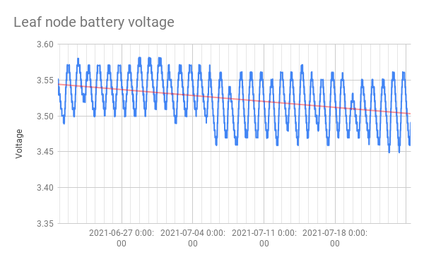

# HAST
Information about the High Altitude Sensor Technology (HAST) Project

## The HAST project
The HAST project is a collaboration between the Montana Technology University Departments of Biology and Electrical Engineering and OPeNDAP. 
The project aims to develop sensor technology that can be used to monitor conditions in the alpine environment in near real-time.

## Project Description

While in-situ environmental sensors excel at recording data on key parameters such as soil temperature and soil moisture, access to sensor data can be challenging. This is especially the case when sensors are placed in remote locations with limited access due to topography, distance, and snow. We study alpine plants and soil of the snowfields and periglacial patterned ground of the Goat Flat alpine tundra (2837 m; 46° 3’ 17” N, 113° 16’ 43” W) in the Pintler Range of Montana. We installed a year-round array of in-situ soil temperature sensors. Currently, we must wait until snowmelt clears the trail in late summer, hike to the tundra, collect the sensors, download data, and replace the sensors at the site. This is cumbersome, as the weather is a wild card in scheduling field trips, sensors must be found (at times with a metal detector) and results in interruptions of data. To increase data accessibility, we devised the prototypical HAST system, which is a device that measures soil temperature and humidity over long periods of time, logs data, and sends it via Iridium satellites to a web host. This ‘main node’ can collect data using sensors connected to its microcontroller and send those data to a remote data store using the Iridium system. We will extend the system to include a second ‘leaf node’ component that will be smaller and cheaper, but without the Iridium satellite modem. Instead, the leaf nodes will use LoRa to communicate with the main node, relying on the main node to forward their data to a remote data store. In this way the complete system will enable remote monitoring of the alpine sites using twenty or more sensors distributed across an area of several hundred feet with modest cost. Each node includes local logging to SD cards, mitigating the risk of LoRa or Iridium communication failure (remote access would be lost, but not the collected data). The hardware used is drawn from the Arduino open-source hardware realm. Both the main and leaf nodes use the RocketScream Mini-Ultro Pro v2 or v3, SD card, RockBlock Mk2 Iridium modem, SHT-10 and SHT-30D sensors. Nodes are powered by lithium-thionyl chloride (Li/SOCl2) batteries rated to - 55°C (our sites preclude using solar panels so rechargeable batteries are not used). The batteries can support operation of the main and leaf nodes for more than a year with hourly sampling. Our work is open source.

## Presentations
We have made the following presentations of the work during the ESIP Labs funding period of xxx to yyy.
* [ESIP Winter meeting, Januaray 2021](presentations/ESIP_EnviroSensing_Winter_2020_Sensors_2.0.pdf)
* [ESIP Summer meeting, July, 2021](presentations/ESIPSUMMERSNOWMEAJHRG71020_wfonts.pdf)
* [MTech UAS Workshop, November, 2021](presentations/UAS_Seminar_Apple_et_al_11621.pdf)

## Development at MTech
The development of the **main node** at MTech is documented in this Github repository.

* [High Altitude Soil Sensing](https://github.com/mtech-ee/HighAltitudeSoilSensing)

## Development at OPeNDAP
Here are five Github repositories for the HAST leaf node part of the project, all of them are publicly accessible. I don't use the Arduino IDE but instead use a tool PlatformIO that works with MS VisualStudio. It supports multi-file code, etc., and works pretty well with Segger J-Link debugger probes (Segger makes a $20-30 probe for educational use that I have).

* [soild sensor common](https://github.com/jgallagher59701/soil_sensor_common): This Arduino library enables communication between the HAST leaf node and a stand-in main node. The MTech main node could use this library at some point, making the integration work less painful. Note that this _will_ work easily with the Arduino IDE.
* [leaf node](https://github.com/jgallagher59701/HAST_leaf_node): This is the code for the leaf node.
* [leaf node PCB](https://github.com/jgallagher59701/HAST_leaf_node_pcb): The KiCAD files for the leaf node Printed Circuit Board.
* [leaf node data](https://github.com/jgallagher59701/HAST_leaf_node_data): A grab bag of data from various leaf node deployments. Also, in here there is a Jupyter notebook with calculations for the batter life of the leaf node based on current measurements of one copy of the node. The link for that notebook is here: [Compute_Leaf_Node_Current](https://github.com/jgallagher59701/HAST_leaf_node_data/blob/main/Compute_Leaf_Node_Current_2.ipynb). Github renders these notebooks so you don’t have to go through the tedium of running them yourself to see the results.
* [lora main node stand-in](https://github.com/jgallagher59701/HAST_lora_main): This is the code for my main node stand-in. It dumps data to an SD card and to the serial port. Included is a python program to read from said serial port and write the info to a CSV file.

## Current use of the leaf node

This graph show current use of the leaf node during the measurement, local data write and lora transmission segments of operation. Once those phases are complete, the node enters the _sleep_ mode, where current consumption is ~19 uA. In planned deployments, one measurement will be made per hour. Battery life for the leaf node is estimated at ~11 years. The link for a notebook that details how the battery life was computer is here: [Compute_Leaf_Node_Current](https://github.com/jgallagher59701/HAST_leaf_node_data/blob/main/Compute_Leaf_Node_Current_2.ipynb). Github renders these notebooks so you don’t have to go through the tedium of running them yourself to see the results.

## Data from a Leaf Node

This figure shows a month of data from a leaf node instance running in Butte, MT. Data were sent over a LoRa link to a stand-in main node and saved to an SD card by the main node. The data show some surprisingly high soil temperatures, but the June to July 2021 period was hot and dry (except for one rain event - see the humidity data in red) and so near-surface soil temperatures of 55°C are within reason.

This figure shows a 0.05 volt decrease in battery voltage over a one month period. Note that this node is sampling at 12 times the rate planned for a non-test deployment, so we expect the batttery to last only a bit more than a year. Note the battery voltage variance with temperature (bule).
